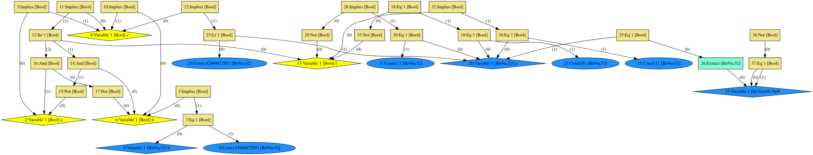

# SMT#

This project provides a parser for a limited subset of the [SMT-LIB standard](http://smtlib.cs.uiowa.edu/) for interaction with 
Satisfiability Modulo Theory (SMT) solvers. While the parser is generated using an attributed grammar
and the [Coco/R](http://www.ssw.uni-linz.ac.at/Coco/) compiler generator.
By now, mostly the theories of **FixedSizeBitVector** and **FloatingPoint** are supported and internally
represented in a graph-like structure of first-class expression types.

The tool then allows to print the resulting expressions (starting from the formula *leaves* - i.e. the variable usages)
as well as export of [GraphVIZ](https://graphviz.org/) code for visualization.
See the [DOT](https://graphviz.gitlab.io/_pages/doc/info/lang.html) format for more information.

This project was developed as a toy application to learn and explore some of the unique language features of C#, 
thus some components were specifically designed to embrace concepts like *runtime supported generic types*,
*delegates*, *properties* or *operator overloading*.

## Usage
The program inherently manages one formula that may be extended via directly input expressions or parsed files.
The state itself can be controlled via meta commands to reset the formula or get an overview of the currently stored expressions.
Note that SMT-LIB expressions for evaluation (`(check-sat)`, `(get-value (...))`) or assertion state control such as `push`, `pop` are simply 
ignored by the parser.

## Options
The project is presented as a basic command line app, sporting a number of interpreted commands.
Per default, any input string is treated as an SMT-LIB expression and therefore directly fed to the parser.
Commands have to be prefixed by "`:`":
- `:load`
  
  It allows input of a file name which must contain valid SMT-LIB expressions.
  The full file is read and parsed and the resulting expressions and declarations added to the current state.

- `:show`
  
  Prints all currently stored expressions to the command line.

- `:vars`

  Prints all declared variables to the command line.

- `:reset`

  Resets the current formula.
  
- `:dot`
  Allows input of a target file to which the current expressions are written in DOT format.

- `:exit`

  Stops the app.

## Examples
The [`samples`](./samples) folder contains test SMT-LIB files that may be read in order to see how the program works.
Note that they are specifically tailored for this example and sometimes fitted with unnecessary meta commands to stress the parser.

For a concrete example, let's take a look at the code from [test01.smt](./samples/test01.smt):
```
(set-logic QF_BV)
(set-option :produce-models true)
(declare-fun a () (_ BitVec 32))
(declare-fun b () (_ BitVec 32))
(declare-fun c () Bool)
(declare-fun d () Bool)
(declare-fun e () Bool)
(declare-fun f () Bool)
(assert e)
(assert (=> e c))
(assert (=> d (= b (_ bv4294967295 32))))
(push 1)
(assert (=> d c))
(assert (=> c (ite f (and d (not e)) (and (not d) e))))
(assert (= f (= a (_ bv0 32))))
(assert (=> c (bvslt (_ bv4294967295 32) a)))
(check-sat)
(pop 1)
(exit)
```

We can load this file via the following command, followed by the target path 
(note that when running this project in an IDE, the base path may not be set to the project root):
```
:load
test01.smt
```

This should result in the following output:
```
:load
test01.smt
Loading file '<path-to>/test01.smt'
```

Afterwards, we can check which variables were declared in this file
```
:vars
```
which prints
```
:vars
================
Declarations:
Nr. of variables: 6)
(a : BitVec32)
(b : BitVec32)
(c : Bool)
(d : Bool)
(e : Bool)
(f : Bool)
================
```

Now let's say, we want to add an additional variable - `NaN` - of sort `BitVec64` 
(i.e. 64bit integer).
Suppose we first make a typo and write the following:
```
(declare-fun NaN () (_ BitVec64))
```
Then the parser will give us the following error message:
```
-- line 1 col 24: invalid Type
```

When we fix that
```
(declare-fun NaN () (_ BitVec 64))
```
and run
```
:vars
```
again afterwards, the following is printed:
```
:vars 
================
Declarations:
Nr. of variables: 7)
(a : BitVec32)
(b : BitVec32)
(c : Bool)
(d : Bool)
(e : Bool)
(f : Bool)
(NaN : BitVec64)
================
```

If we use `:show`, we see all the expressions in the formula:
```
:show
================
Current formula:
Nr. of expressions: 25)
(a : BitVec32)
((a : BitVec32) == (0 : BitVec32))
((f : Bool) == ((a : BitVec32) == (0 : BitVec32)))
(f : Bool)
((f : Bool) ? ((d : Bool) && !(e : Bool)) : (!(d : Bool) && (e : Bool)))
((c : Bool) => ((f : Bool) ? ((d : Bool) && !(e : Bool)) : (!(d : Bool) && (e : Bool))))
(c : Bool)
((e : Bool) => (c : Bool))
(e : Bool)
!(e : Bool)
((d : Bool) && !(e : Bool))
(d : Bool)
((d : Bool) => ((b : BitVec32) == (4294967295 : BitVec32)))
((b : BitVec32) == (4294967295 : BitVec32))
(b : BitVec32)
(4294967295 : BitVec32)
((d : Bool) => (c : Bool))
!(d : Bool)
(!(d : Bool) && (e : Bool))
((c : Bool) => ((4294967295 : BitVec32) < (a : BitVec32)))
((4294967295 : BitVec32) < (a : BitVec32))
(4294967295 : BitVec32)
(1 : BitVec32)
(0 : BitVec32)
(NaN : BitVec64)
================
```
From the initial formula we can derive that `f` essentially indicates whether `a` is zero.
Let's not add another expression that fixates `a` to be `1` if `f` does not hold:
```
(assert (=> (not f) (= a (_ bv1 32))))
```

Again using `:show` shows how the number of expressions have changed:
```
:show
================
Current formula:
Nr. of expressions: 28)
(a : BitVec32)
((a : BitVec32) == (0 : BitVec32))
((f : Bool) == ((a : BitVec32) == (0 : BitVec32)))
(f : Bool)
((f : Bool) ? ((d : Bool) && !(e : Bool)) : (!(d : Bool) && (e : Bool)))
((c : Bool) => ((f : Bool) ? ((d : Bool) && !(e : Bool)) : (!(d : Bool) && (e : Bool))))
(c : Bool)
((e : Bool) => (c : Bool))
(e : Bool)
!(e : Bool)
((d : Bool) && !(e : Bool))
(d : Bool)
((d : Bool) => ((b : BitVec32) == (4294967295 : BitVec32)))
((b : BitVec32) == (4294967295 : BitVec32))
(b : BitVec32)
(4294967295 : BitVec32)
((d : Bool) => (c : Bool))
!(d : Bool)
(!(d : Bool) && (e : Bool))
((c : Bool) => ((4294967295 : BitVec32) < (a : BitVec32)))
((4294967295 : BitVec32) < (a : BitVec32))
(4294967295 : BitVec32)
!(f : Bool)
(!(f : Bool) => ((a : BitVec32) == (1 : BitVec32)))
((a : BitVec32) == (1 : BitVec32))
(1 : BitVec32)
(0 : BitVec32)
(NaN : BitVec64)
================
```

Now let's play around with our new variable a bit. 
First off, let's set it to be equal to `a` (by extracting bits 0-31):
```
(assert (= ((_ extract 31 0) NaN) a))
```
Once again, `:show` shows the newly added expressions:
```
...
(((BitVec32:0) (NaN : BitVec64)) == (a : BitVec32))
((BitVec32:0) (NaN : BitVec64))
...
```
Now we can ensure that `NaN` really constitutes a non-computable number by adding a real contradiction:
```
(assert (not (= NaN NaN)))
```

This now really represents "some kind of integer `NaN`" (at least in SMT-LIB terms).

Afterwards, we can now look at the generated formula in the graph view by generating a DOT file:
```
:dot
formula.dot
```

Which will write the code in the corresponding file (in text format).
Now, we can use one of the existing tools to visualize the GraphVIZ graph, e.g. 
[dreampuf.github.io](https://dreampuf.github.io/GraphvizOnline/#digraph%20SMTLIB%20%7B%0A20%20%5Bstyle%3Dfilled%20shape%3Ddiamond%20fillcolor%3Ddodgerblue%20label%3D%2220%3AVariable%601%20%5BBitVec32%5D%20a%22%5D%0A19%20%5Bstyle%3Dfilled%20shape%3Dbox%20fillcolor%3Dkhaki%20label%3D%2219%3AEq%601%20%5BBool%5D%22%5D%0A18%20%5Bstyle%3Dfilled%20shape%3Dbox%20fillcolor%3Dkhaki%20label%3D%2218%3AEq%601%20%5BBool%5D%22%5D%0A13%20%5Bstyle%3Dfilled%20shape%3Ddiamond%20fillcolor%3Dyellow%20label%3D%2213%3AVariable%601%20%5BBool%5D%20f%22%5D%0A12%20%5Bstyle%3Dfilled%20shape%3Dbox%20fillcolor%3Dkhaki%20label%3D%2212%3AIte%601%20%5BBool%5D%22%5D%0A11%20%5Bstyle%3Dfilled%20shape%3Dbox%20fillcolor%3Dkhaki%20label%3D%2211%3AImplies%20%5BBool%5D%22%5D%0A4%20%5Bstyle%3Dfilled%20shape%3Ddiamond%20fillcolor%3Dyellow%20label%3D%224%3AVariable%601%20%5BBool%5D%20c%22%5D%0A3%20%5Bstyle%3Dfilled%20shape%3Dbox%20fillcolor%3Dkhaki%20label%3D%223%3AImplies%20%5BBool%5D%22%5D%0A2%20%5Bstyle%3Dfilled%20shape%3Ddiamond%20fillcolor%3Dyellow%20label%3D%222%3AVariable%601%20%5BBool%5D%20e%22%5D%0A15%20%5Bstyle%3Dfilled%20shape%3Dbox%20fillcolor%3Dkhaki%20label%3D%2215%3ANot%20%5BBool%5D%22%5D%0A14%20%5Bstyle%3Dfilled%20shape%3Dbox%20fillcolor%3Dkhaki%20label%3D%2214%3AAnd%20%5BBool%5D%22%5D%0A6%20%5Bstyle%3Dfilled%20shape%3Ddiamond%20fillcolor%3Dyellow%20label%3D%226%3AVariable%601%20%5BBool%5D%20d%22%5D%0A5%20%5Bstyle%3Dfilled%20shape%3Dbox%20fillcolor%3Dkhaki%20label%3D%225%3AImplies%20%5BBool%5D%22%5D%0A7%20%5Bstyle%3Dfilled%20shape%3Dbox%20fillcolor%3Dkhaki%20label%3D%227%3AEq%601%20%5BBool%5D%22%5D%0A8%20%5Bstyle%3Dfilled%20shape%3Ddiamond%20fillcolor%3Ddodgerblue%20label%3D%228%3AVariable%601%20%5BBitVec32%5D%20b%22%5D%0A9%20%5Bstyle%3Dfilled%20shape%3Doval%20fillcolor%3Ddodgerblue%20label%3D%229%3AConst%7B4294967295%7D%20%5BBitVec32%5D%22%5D%0A10%20%5Bstyle%3Dfilled%20shape%3Dbox%20fillcolor%3Dkhaki%20label%3D%2210%3AImplies%20%5BBool%5D%22%5D%0A17%20%5Bstyle%3Dfilled%20shape%3Dbox%20fillcolor%3Dkhaki%20label%3D%2217%3ANot%20%5BBool%5D%22%5D%0A16%20%5Bstyle%3Dfilled%20shape%3Dbox%20fillcolor%3Dkhaki%20label%3D%2216%3AAnd%20%5BBool%5D%22%5D%0A22%20%5Bstyle%3Dfilled%20shape%3Dbox%20fillcolor%3Dkhaki%20label%3D%2222%3AImplies%20%5BBool%5D%22%5D%0A23%20%5Bstyle%3Dfilled%20shape%3Dbox%20fillcolor%3Dkhaki%20label%3D%2223%3ALt%601%20%5BBool%5D%22%5D%0A24%20%5Bstyle%3Dfilled%20shape%3Doval%20fillcolor%3Ddodgerblue%20label%3D%2224%3AConst%7B4294967295%7D%20%5BBitVec32%5D%22%5D%0A29%20%5Bstyle%3Dfilled%20shape%3Dbox%20fillcolor%3Dkhaki%20label%3D%2229%3ANot%20%5BBool%5D%22%5D%0A28%20%5Bstyle%3Dfilled%20shape%3Dbox%20fillcolor%3Dkhaki%20label%3D%2228%3AImplies%20%5BBool%5D%22%5D%0A30%20%5Bstyle%3Dfilled%20shape%3Dbox%20fillcolor%3Dkhaki%20label%3D%2230%3AEq%601%20%5BBool%5D%22%5D%0A31%20%5Bstyle%3Dfilled%20shape%3Doval%20fillcolor%3Ddodgerblue%20label%3D%2231%3AConst%7B1%7D%20%5BBitVec32%5D%22%5D%0A33%20%5Bstyle%3Dfilled%20shape%3Dbox%20fillcolor%3Dkhaki%20label%3D%2233%3ANot%20%5BBool%5D%22%5D%0A32%20%5Bstyle%3Dfilled%20shape%3Dbox%20fillcolor%3Dkhaki%20label%3D%2232%3AImplies%20%5BBool%5D%22%5D%0A34%20%5Bstyle%3Dfilled%20shape%3Dbox%20fillcolor%3Dkhaki%20label%3D%2234%3AEq%601%20%5BBool%5D%22%5D%0A35%20%5Bstyle%3Dfilled%20shape%3Doval%20fillcolor%3Ddodgerblue%20label%3D%2235%3AConst%7B1%7D%20%5BBitVec32%5D%22%5D%0A21%20%5Bstyle%3Dfilled%20shape%3Doval%20fillcolor%3Ddodgerblue%20label%3D%2221%3AConst%7B0%7D%20%5BBitVec32%5D%22%5D%0A25%20%5Bstyle%3Dfilled%20shape%3Dbox%20fillcolor%3Dkhaki%20label%3D%2225%3AEq%601%20%5BBool%5D%22%5D%0A26%20%5Bstyle%3Dfilled%20shape%3Dbox%20fillcolor%3Daquamarine%20label%3D%2226%3AExtract%20%5BBitVec32%5D%22%5D%0A27%20%5Bstyle%3Dfilled%20shape%3Ddiamond%20fillcolor%3Ddodgerblue%20label%3D%2227%3AVariable%601%20%5BBitVec64%5D%20NaN%22%5D%0A37%20%5Bstyle%3Dfilled%20shape%3Dbox%20fillcolor%3Dkhaki%20label%3D%2237%3AEq%601%20%5BBool%5D%22%5D%0A36%20%5Bstyle%3Dfilled%20shape%3Dbox%20fillcolor%3Dkhaki%20label%3D%2236%3ANot%20%5BBool%5D%22%5D%0A%2219%22%20-%3E%20%2220%22%20%5Blabel%3D%22(0)%22%5D%3B%0A%2219%22%20-%3E%20%2221%22%20%5Blabel%3D%22(1)%22%5D%3B%0A%2218%22%20-%3E%20%2213%22%20%5Blabel%3D%22(0)%22%5D%3B%0A%2218%22%20-%3E%20%2219%22%20%5Blabel%3D%22(1)%22%5D%3B%0A%2212%22%20-%3E%20%2213%22%20%5Blabel%3D%22(0)%22%5D%3B%0A%2212%22%20-%3E%20%2214%22%20%5Blabel%3D%22(1)%22%5D%3B%0A%2212%22%20-%3E%20%2216%22%20%5Blabel%3D%22(2)%22%5D%3B%0A%2211%22%20-%3E%20%224%22%20%5Blabel%3D%22(0)%22%5D%3B%0A%2211%22%20-%3E%20%2212%22%20%5Blabel%3D%22(1)%22%5D%3B%0A%223%22%20-%3E%20%222%22%20%5Blabel%3D%22(0)%22%5D%3B%0A%223%22%20-%3E%20%224%22%20%5Blabel%3D%22(1)%22%5D%3B%0A%2215%22%20-%3E%20%222%22%20%5Blabel%3D%22(0)%22%5D%3B%0A%2214%22%20-%3E%20%226%22%20%5Blabel%3D%22(0)%22%5D%3B%0A%2214%22%20-%3E%20%2215%22%20%5Blabel%3D%22(1)%22%5D%3B%0A%225%22%20-%3E%20%226%22%20%5Blabel%3D%22(0)%22%5D%3B%0A%225%22%20-%3E%20%227%22%20%5Blabel%3D%22(1)%22%5D%3B%0A%227%22%20-%3E%20%228%22%20%5Blabel%3D%22(0)%22%5D%3B%0A%227%22%20-%3E%20%229%22%20%5Blabel%3D%22(1)%22%5D%3B%0A%2210%22%20-%3E%20%226%22%20%5Blabel%3D%22(0)%22%5D%3B%0A%2210%22%20-%3E%20%224%22%20%5Blabel%3D%22(1)%22%5D%3B%0A%2217%22%20-%3E%20%226%22%20%5Blabel%3D%22(0)%22%5D%3B%0A%2216%22%20-%3E%20%2217%22%20%5Blabel%3D%22(0)%22%5D%3B%0A%2216%22%20-%3E%20%222%22%20%5Blabel%3D%22(1)%22%5D%3B%0A%2222%22%20-%3E%20%224%22%20%5Blabel%3D%22(0)%22%5D%3B%0A%2222%22%20-%3E%20%2223%22%20%5Blabel%3D%22(1)%22%5D%3B%0A%2223%22%20-%3E%20%2224%22%20%5Blabel%3D%22(0)%22%5D%3B%0A%2223%22%20-%3E%20%2220%22%20%5Blabel%3D%22(1)%22%5D%3B%0A%2229%22%20-%3E%20%2213%22%20%5Blabel%3D%22(0)%22%5D%3B%0A%2228%22%20-%3E%20%2229%22%20%5Blabel%3D%22(0)%22%5D%3B%0A%2228%22%20-%3E%20%2230%22%20%5Blabel%3D%22(1)%22%5D%3B%0A%2230%22%20-%3E%20%2220%22%20%5Blabel%3D%22(0)%22%5D%3B%0A%2230%22%20-%3E%20%2231%22%20%5Blabel%3D%22(1)%22%5D%3B%0A%2233%22%20-%3E%20%2213%22%20%5Blabel%3D%22(0)%22%5D%3B%0A%2232%22%20-%3E%20%2233%22%20%5Blabel%3D%22(0)%22%5D%3B%0A%2232%22%20-%3E%20%2234%22%20%5Blabel%3D%22(1)%22%5D%3B%0A%2234%22%20-%3E%20%2220%22%20%5Blabel%3D%22(0)%22%5D%3B%0A%2234%22%20-%3E%20%2235%22%20%5Blabel%3D%22(1)%22%5D%3B%0A%2225%22%20-%3E%20%2226%22%20%5Blabel%3D%22(0)%22%5D%3B%0A%2225%22%20-%3E%20%2220%22%20%5Blabel%3D%22(1)%22%5D%3B%0A%2226%22%20-%3E%20%2227%22%20%5Blabel%3D%22(0)%22%5D%3B%0A%2237%22%20-%3E%20%2227%22%20%5Blabel%3D%22(0)%22%5D%3B%0A%2237%22%20-%3E%20%2227%22%20%5Blabel%3D%22(1)%22%5D%3B%0A%2236%22%20-%3E%20%2237%22%20%5Blabel%3D%22(0)%22%5D%3B%0A%7D%0A).

The result than looks as follows:


The DOT code is provided in [./docs/test01.dot](./docs/test01.dot)

To start anew or exit the app, we can then use
```
:reset
```
or
```
:exit
```

## Q&A
- Which SMT-LIB logics are supported?

  Currently, a subset of definitions from the 
  [Core](http://smtlib.cs.uiowa.edu/theories-Core.shtml) (`Bool` sort etc.), 
  [FixedSizeBitVector](http://smtlib.cs.uiowa.edu/theories-FixedSizeBitVectors.shtml) and
  [FloatingPoint](http://smtlib.cs.uiowa.edu/theories-FloatingPoint.shtml) theories are implemented, 
  but the expression framework allows extension for additional operations or sorts.

- How can the GraphVIZ code be opened?

  If not directly installed on the system, there exist various online tools for visualizing DOT files.
  Examples:
  - https://dreampuf.github.io/GraphvizOnline/
  - http://webgraphviz.com/
  - http://sandbox.kidstrythisathome.com/erdos/

- Why are the expressions implemented as first-class objects?
  
  Of course, in its current state expressions could also be implemented in a more limited set of types (e.g. `Expression{Type = ADD, X = <..>, Y = <..>}`).
  This was not done on purpose, as to enable future, expression specific simplifications or implementation details (e.g. simplifications for logic combinators) as well as
  already specialize some expressions towards types (e.g. different `And` expressions for `FixedSizeBitVector` and `Bool`).
  
- Why is there no GUI?
  
  This project is primarily developed on linux using the .NET core utilities. Therefore, framework support for *Windows Forms* or *WPF* is lacking.
  Additionally, platform independence is (despite using C#) a major requirement.

## Future work
- Add SMT-LIB generator to convert expressions back to SMT-LIB
- Similarity check for added expressions (e.g. do not generate same expression twice)
- Add obfuscator for SMT-LIB (e.g. automated variable renaming, extraction of nested expressions)
- Add GraphViz generator (binary format)
- Probably add some sort of web-based GUI (i.e. control via simple web GUI with global state on server)
